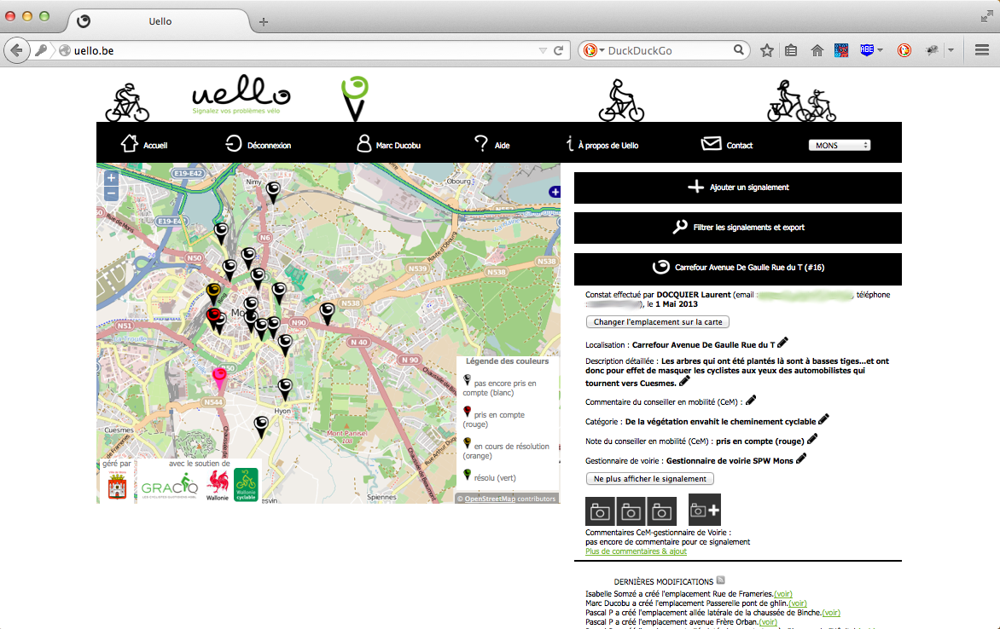

Lorsque vous êtes enregistré en temps que conseillé en mobilité (CeM) de nouvelles fonctionnalités sont disponibles.

<h1>Contacter un signaleur</h1>

Quand un signalement est sélectionné (après avoir cliqué sur son icône, se trouvant sur la carte, du signalement), l'adresse électronique et le numéro de téléphone du signaleur sont affichées.

<h1>Editer un signalement</h1>

<h2>Editer les données textuelles</h2>

Quand un signalement est sélectionné, vous  pouvez éditer une donnée en cliquant sur l'icone d'édition qui se trouve juste à coté de la donnée.

<h2>Déplacer un signalement</h2>

Quand un signalement est sélectionné, vous pouvez modifier sa position sur la carte. Pour ce faire, il suffit de cliquer sur le bouton "changer l'emplacement sur la carte" et ensuite de choisir la nouvelle position en cliquant sur la carte.

<h1>Ne plus afficher un signalement sur la carte</h1>

Quand un signalement est sélectionné, vous  pouvez choisir de ne plus afficher ce signalement sur la carte. Pour ce faire, il suffit de cliquer sur le bouton "ne plus afficher le signalement".

<h1>Assigner un gestionnaire de voirie à un signalement</h1>

Quand un signalement est sélectionné, vous  pouvez assigner un gestionnaire de voirie à un signalement. Pour ce faire, il suffit de cliquer sur le bouton d'édition à coté du champ "Gestionnaire de voirie", de choisir dans la liste le gestionnaire et d'appuyer sur l'icône "sauver".
Un courrier électronique sera automatiquement envoyé au gestionnaire pour l'informer de l'assignation et l'inviter à résoudre le problème.

<h1>Modifier l'état d'un signalement</h1>

Quand un signalement est sélectionné, vous pouvez choisir l'état du signalement. L'état définit la couleur du marqueur du signalement. Les différents états sont rejeté (gris), pas encore pris en compte (blanc), pris en compte (rouge), en cours de résolution (orange) et résolu (vert). Pour choisir l'état du signalement, il suffit de cliquer sur le bouton d'édition à coté du champ "Note du conseiller en mobilité (CeM)", de choisir dans la liste l'état et d'appuyer sur l'icône "sauver".

