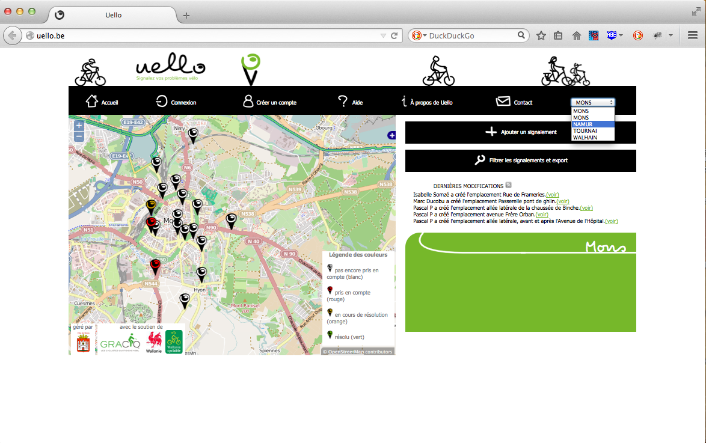
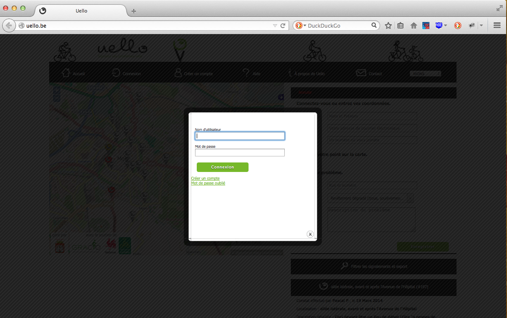

<h1>Sélectionner une ville</h1>
<h2>A partir de l'écran d'accueil</h2>

Pour sélectionner une ville  à partir de l'écran d'accueil, faites votre choix à l'aide du menu déroulant ou cliquez sur le nom de la ville.

<h2>A partir de l'écran "carte"</h2>

Pour sélectionner une ville  à partir de l'écran "carte", faites votre choix à l'aide du menu déroulant.

<h1>Voir en détails un signalement</h1>

Pour afficher en détails un signalement il suffit de cliquer dessus dans la carte. Les détails du signalement apparaîtront dans l'espace d'affichage qui se trouve à droite de la carte.

<h1>Choisir les signalements affichés et export</h1>

Vous pouvez choisir les signalements affichés sur la carte en utilisant le menu "Filtrer les signalements et export". Il suffit de cliquer sur le titre du menu et les options d'affichage apparaîtront. 
Grâce à ce menu, vous pouvez télécharger un fichier CSV contenant les signalements affichés sur la carte. Vous devez simplement cliquer sur le lien CSV.

<h1>Signaler un problème</h1>

Pour signalez un problème, cliquez sur le bouton "ajouter un signalement". Un formulaire apparaît. Remplissez ce formulaire et cliquez sur le bouton "Enregister". Attention vous devez 
indiquer la localisation du signalement en cliquant sur la carte.

<h1>Se connecter</h1>

Pour vous connecter, cliquez sur le bouton "connexion" se trouvant en haut à droite de la page.

Un formulaire apparaît ; il suffit de le remplir et de cliquer sur le bouton "connexion".

<h1>S'enregistrer sur le site</h1>

Si vous n'avez pas de compte vous pouvez vous enregistrer sur le site. Pour afficher le formulaire d'enregistrement cliquez sur le bouton "créer un compte.

Ensuite remplissez le formulaire et cliquez sur le bouton "Enregister".

<h1>Pourquoi s'inscrire sur le site?</h1>

Le principal avantage d'être inscrit est que la procédure de signalement est simplifiée. En effet, l'utilisateur inscrit et enregistré ne doit pas remplir les champs "nom", "prénom", "numéro de téléphone" et "e-mail".